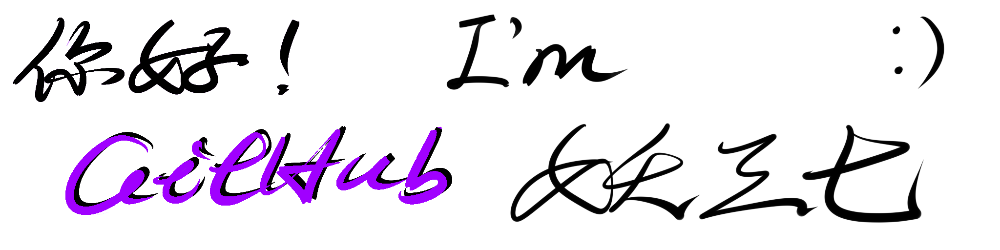

# 自我介绍 (Self-Introduction)

*<gray>It is my simple and crude signature* :frowning:

 <h1>:wave: About Me :wave:</h1>

    

## Welcome To My GitHub!

### My Brief Self-Introduction 🤔

My name is **Yaosanqi ( 妖三七 )** :grinning:. I'm a Computer Science student in **Ocean University of China (中国海洋大学 OUC)** :mortar_board:

I'm 19-year-old now, and I come from Meizhou in Guangdong province of China. I love to study computers since I was a pupil. For now, I'm studying Java, Python, C.

---
## My GitHub Stats 🏆

  

---
### My Social Account :star_struck:

- :tv:**BiliBili**: [yao37](https://space.bilibili.com/363216678)
- :penguin:**QQ**: 3212576603
- :speaker:**Discord Name**: yao37

### My Email :mailbox:

- Outlook: zxc18023571263@outlook.com
- QQ Mail: 3212576603@QQ.com
